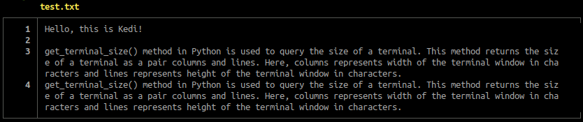

# Kedi

### *An enhanced cat command*

## What is this?

> Basically it's a command for outputting files in the terminal

Kedi is a script developed in Python, conceived from the desire of a better `cat` command. It aims to provide you with the same functionality as the standard `cat` command, but presenting it in a more visual-appealing manner.

Here's a simple example of how it actually looks:

</img>

## How to install?

> Just put the Kedi executable in your bin directory

```
$ sudo mv kedi /usr/bin/kedi
```

## What does Kedi mean?

> Cat

The `cat` command reminds me of cats, so Kedi is just 'cat' in the Turkish language :-)